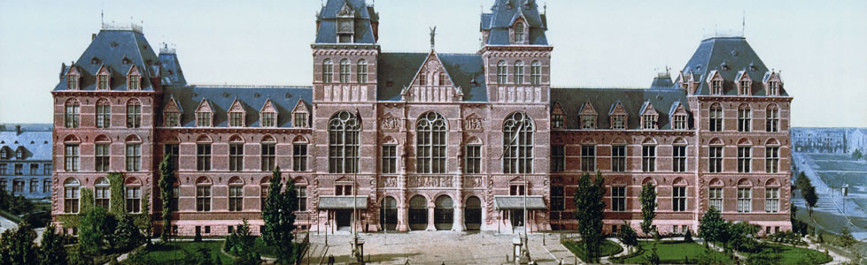
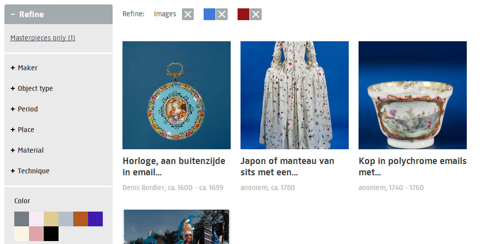
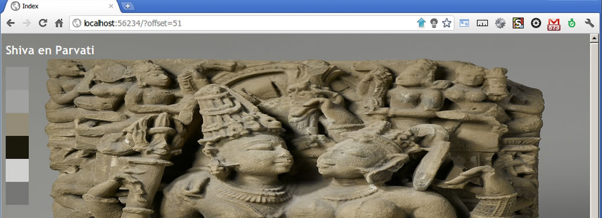

The Rijksmuseum, the dutch national museum, has been [closed for nearly a decade](http://www.bbc.co.uk/news/entertainment-arts-19517742) for interior renovations and will reopen its doors in April 2013. 

Much like the physical renovations, the rijksmuseum.nl website had to undergo some massive changes on the in- as well as the exterior. In fact we completely started from scratch.

The new site on the left focussed alot on the declutterization of the old site (right) forcing a tablet/fat finger first approach to presenting information.

I could waiste many more paragraphs outlining the scope of the project but [Peter Gorgels](https://twitter.com/pgorgels) wrote [an excellent paper](http://mw2013.museumsandtheweb.com/paper/rijksstudio-make-your-own-masterpiece/) that does a better job than I ever could.

What I like to do in this post is to outline one of the many features of the new website that I had immense joy building: color search.

The rijksmuseum has an immense collection of well over half a million art objects of which only a subset of [283,376 are catalogized and exposed on the website](https://www.rijksmuseum.nl/en/search?s=relevance&f=1&p=1&ps=12) and [OAI harvest api](https://www.rijksmuseum.nl/en/api/instructions-for-use) endpoints. A subset of this subset are [143,209 art objects](https://www.rijksmuseum.nl/en/search?s=relevance&f=1&p=1&ps=12&imgonly=True) that have imagery associated with them AND are free of rights so that we can actually expose them on the website. This number is groing every week though.

For all these [143,209 art objects](https://www.rijksmuseum.nl/en/search?s=relevance&f=1&p=1&ps=12&imgonly=True) the rijksmuseum actually has several images

1. There's the enormous original TIFF picture ranging from 100 to 600MB of the original shooting, which includes color swatches on the side for quality control.
2. A `web image` that is a 100% quality JPEG version of the TIFF resized to around 2500*2500px, although some artobjects' web image far exceeds this and go up to TODO px. They're manually cropped in India to fully show the object in question and removing the colorswatch(es) placed on the side(s) in the original.
3. Many support imagery, think the back of the painting or alternative perspectives.

How can anyone calling him/herself a nerd not play with this data? In fact if I'm recalling correctly color search was never even in the original scope for the new search section. 

While [tinkering with the images over the '11 Christmas period](https://twitter.com/Mpdreamz/status/151340411414249472) I hacked together a super bruteforce method to get the Nth most distinctive colors from a `web image`

Meaning the N colors of significance in the picture but with a maximum distance between themselves. This so that a smudge of bright blue in a corner has a chance to survive the clustering.

The clustering algorithm to get this done whilst functionaly very effective is also terribly innefficient

    # pseudo code
    colors[] = imageGetAllColors()
    while (colors.length > N)
        foreach (color in colors)
            editDistance = -1;
            colorWithLeastDistance = null;
            foreach (color2 in colors)
                if (color2 == color)
                    continue
                if (editDistance < -1 || diff(color, color2) < editDistance)
                    colorWithLeastDistance = color2;

            colors.remove(color);
            colors.remove(colorWithLeastDistance);
            colors.add(averageColor(color, colorWithLeastDistance))

We don't need to calculate its big O notation to know the performance will degrade rather quickly the more colors we start with (If anyone actually calculates its big O notation post a comment!). So making `imageGetAllColors()` return as few pixels as possible to start with reliably is key to get sane running times when we actually apply this to 140k artobject images.