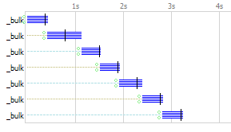

Yesterday I recieved a bug report on [NEST](https://github.com/Mpdreamz/NEST), my .net client for elasticsearch. Now I've received many bug reports in the last 2 years and on several occasions these bug reports made me feel humiliated to the bone.

`Yes, I wrote that and yes, that's pretty stupid` 

Now I am only human, my first reaction when I receive a pretty severe bug report is: `Surely this can't be true` and `Come on! I'm not that stupid!` but 90% of the time I investigate and can only conclude: `Yes it IS true` and `Yes I AM that stupid`.

[Yesterday's bug report](https://github.com/Mpdreamz/NEST/issues/189), was a prime example of this.

```markdown
Async requests are not really async
------
Hi,
I noticed that SearchAsync is making synchronous calls in reality.
I think the fault might be with this code (DoAsyncRequest):

if (tcs.Task != null && tcs.Task.Result != null)

As it accesses the Task's Result, we wait for the task to complete...
```

Fuck me thats pretty severe! `Surely this can't be true` and `Come on! I'm not that stupid!` Looking [at the code](https://github.com/Mpdreamz/NEST/blob/9aed4e2e90087d2ffb398dc18b68159190f951f3/src/Nest/Domain/Connection/Connection.cs#L156-L167) though:

```cs
var tcs = new TaskCompletionSource<ConnectionStatus>();
this.Iterate(this._AsyncSteps(request, tcs, data), tcs);
if (tcs.Task != null && tcs.Task.Result != null)
{
    tcs.Task.Result.Request = data;
    tcs.Task.Result.RequestUrl = request.RequestUri.ToString();
    tcs.Task.Result.RequestMethod = request.Method;
}
return tcs.Task;
```

Damnit! `Yes it IS true` and `Yes I AM that stupid`. Fair enough the fix seems easy enough, return a continuation on the task instead.

```cs
var tcs = new TaskCompletionSource<ConnectionStatus>();
this.Iterate(this._AsyncSteps(request, tcs, data), tcs);
return tcs.Task.ContinueWith(t =>
{
    cs.Task.Result.Request = data;
    tcs.Task.Result.RequestUrl = request.RequestUri.ToString();
    tcs.Task.Result.RequestMethod = request.Method;
    return tcs.Task.Result;
});
```

Nest's comes with a demo indexer that tests the troughput of the different `IConnection` implementations. The code itself looks like this:

```cs
var partitionedMessages = msgGenerator.Generate(numMessages).Partition(bufferSize);
Interlocked.Exchange(ref NumSent, 0);
foreach (var messages in partitionedMessages)
{
    var t = client.IndexManyAsync(messages, indexName, bulkParms);
    tasks.Add(t);

    Interlocked.Add(ref NumSent, bufferSize);
    if (NumSent % 10000 == 0)
    {
        Console.WriteLine("Sent {0:0,0} messages to {1}", NumSent, indexName);
    }
}
Task.WaitAll(tasks.ToArray());
```

`msgGenerator` generates ` new Message()`'s' without doing ANY IO. So I really should be seeing multiple requests being being processed at the same time.

Yet fiddlers timeline shows me something pretty horrific:



Somethings still blocking damnit.

For reference here's the throughput the test app reports:


Fuck me these are not anywhere near the throughput numbers [I reported 4 months ago](https://github.com/Mpdreamz/NEST/pull/112#issuecomment-10266029)

```markdown
HTTP: 12123 docs/s
Thrift: 17575 docs/s
```
Mother of regressions!

Looking at the `"fixed code"` again:

```cs
var tcs = new TaskCompletionSource<ConnectionStatus>();
this.Iterate(this._AsyncSteps(request, tcs, data), tcs);
return tcs.Task.ContinueWith(t =>
{
    cs.Task.Result.Request = data;
    tcs.Task.Result.RequestUrl = request.RequestUri.ToString();
    tcs.Task.Result.RequestMethod = request.Method;
    return tcs.Task.Result;
});
```

The `TaskCompletionSource` still blocks while it coordinates the async steps. Let's try that again:

```cs
var tcs = new TaskCompletionSource<ConnectionStatus>();
if (!this._ResourceLock.WaitOne(timeout))
{
    var m = "Could not start the operation before the timeout of " + timeout + "ms completed while waiting for the semaphore";
    tcs.SetResult(new ConnectionStatus(new TimeoutException(m)));
    return tcs.Task;
}
try
{
    return Task.Factory.StartNew(() =>
    {
        this.Iterate(this._AsyncSteps(request, tcs, data), tcs);
        return tcs.Task.Result;
    }, TaskCreationOptions.LongRunning);
}
finally
{
    this._ResourceLock.Release();
}
```

Here I explicitly start a new Task and on top of that moved the semaphore out of `_AsyncSteps()` so we delay the creation of `Task<T>`'s to the very last second. The `TaskCreationOptions.LongRunning` is also key here to prevent threadpool starvation! The TPL will prefer to really start a new Thread for your task not take one from the threadpool. 

Let's see how we are doing now:


Yes! that's more like it!


Nice, we actually improved throughput from 12k 4 months ago to 17k now. Awesome!

This is why developing in the open is so awesome, it keeps you humble and grounded benefiting both your sanity and the quality of the project.

These fixes are pushed to nuget and in [Nest 0.9.20.0](https://www.nuget.org/packages/Nest)


