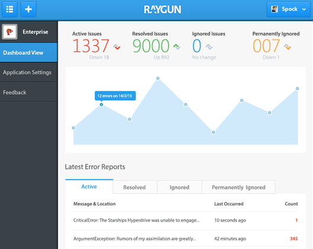
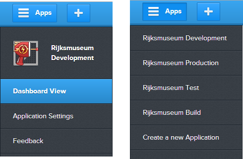
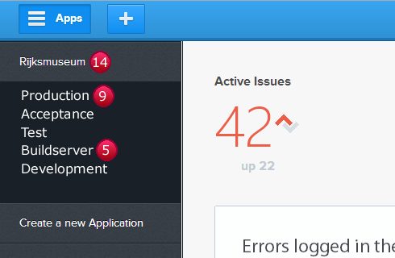
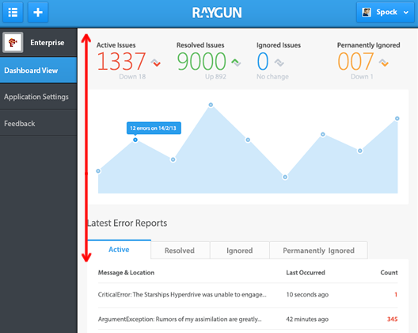
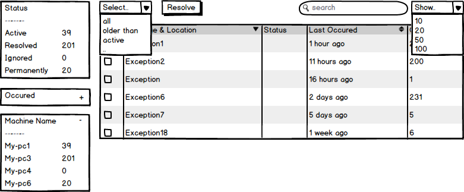
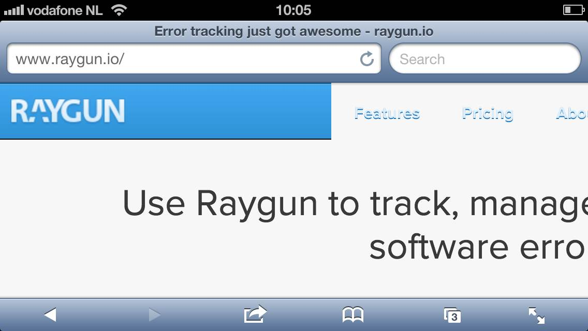
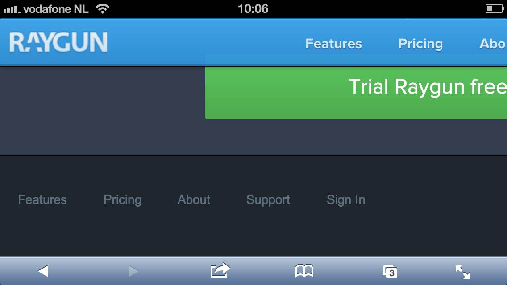
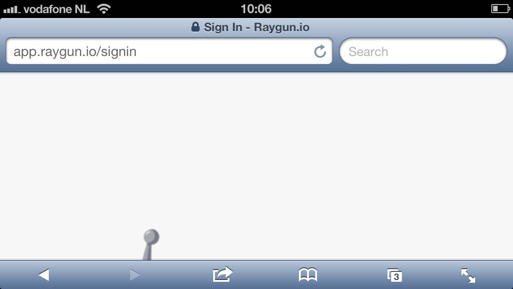
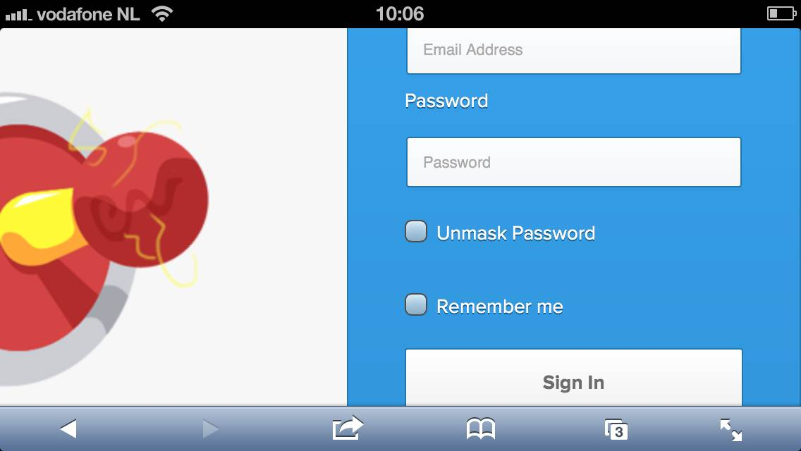

[raygun.io](http://raygun.io) is a new application error monitoring service for many languages and platforms from the kiwi's over at [Mindscape](http://www.mindscapehq.com/).  

Since this will mostly be a rant about the things I `don't` like I'd like to state first and foremost that I'm `using and paying` for this service and am `very content` overall!.

Ok let's start 

The menu introduces a toggle between current app options and listing all the applications. I'd much much rather see an accordion like design here:

This lets me group different applications, staging environments in this case, together and get an immediate glimpse of the state of all my applications/application groups. The ugly red balls in my mockup  are suppose to be error counts. I  can then use the abundance of space on the right to toggle application views. Which also brings me to my next point: the dashboard view.

As you can see in the above image this is the only overview page you have for all the errors in your application. All the noise is great for a dashboard view but I really need a hardcore straight up list of data. Remember the image above is scaled down pretty much already.The fancy graph nearly pushes the errors off screen on my 22" full hd monitors.

I'd much rather see a data first view as the default, sort of like this:

Wow me here good folk over at Mindscape, let me choose the facets I want, let me select all the errors older then 2 days (even if there are over 9000 of them) and resolve them in 2 clicks. 

The last big area [raygun.io](http://raygun.io) needs to improve is mobile support. Today on the train ride back home I received emails from [raygun.io](http://raygun.io) of exceptions occurring on the testing environment. Followed pretty quickly by the client emailing he spotted a bug. "Great!",I thought, "let me look at the exceptions on my iPhone!" so I can respond to the client with an informed answer. 

Oomph, this doesn't look responsive at all. I can't get to the top right login button I know is there.

Ohh I'm in luck, there's a sign in link in the footer.

Hello whitespace!, luckily I know the login box is to the right

From here I enter my details and hit submit... nothing... no loading icon .... I give up.

As I don't like closing on a negative note let me repeat that I've long been a fan of the guys and girls over at Mindscape. I'm glad they got [raygun.io](http://raygun.io) out the door early to let early adopters like myself moan and groan, that's a good thing and a sign of a healthy project. Considering this service went from inception to being up and running in a couple of months and is already in the state it is now speaks parts on how things will shape up in the future.

